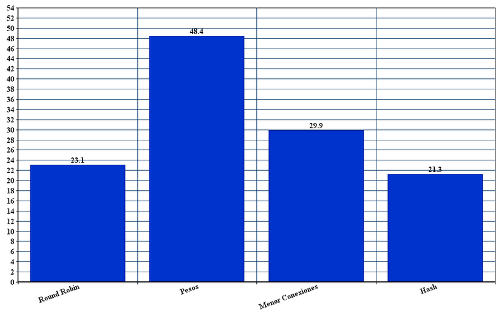
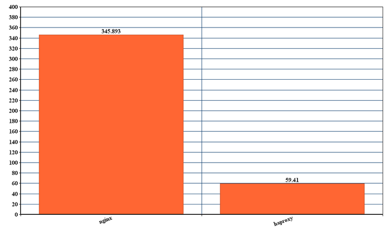

#Configuración nginx haproxy

##Autores:
 : ####Alejandro Casado Quijada
 : ####Salvador Rueda Molina

##Introducción

El objetivo de este trabajo es configurar los balanceadores de carga nginx y haproxy con diferentes algoritmos de balanceo y comprobar su rendimiento utilizando las herramientas Apache Benchmark y Siege.

La topología es la siguiente:

* 1 Máquina balanceadora

* 3 Servidores finales

Los algoritmos a utilizar son:

* Round robin

* Pesos (Máquina 1 peso = 3, Máquina 2 peso = 2, Máquina 3 peso = 1)

* Menor número de conexiones

* Basado en tabla hash

Para cada algoritmo se va a usar ab con los siguientes escenarios

* Baja carga: 100 peticiones y nivel de concurrencia 5

* Media carga: 1000 peticiones y nivel de concurrencia 50

* Alta carga: 5000 peticiones y nivel de concurrencia 250

Se van a analizar los campos:

* Time taken for tests, el tiempo necesario para llevar a cabo los test

* Failed requests, el número de peticiones fallidas.

* Requests per second, el total de peticiones por segundo

En el caso de Siege tenemos los siguientes:

* Baja carga: 15 usuarios simultáneos durante 30 segundos

* Baja carga: 30 usuarios simultáneos durante 30 segundos

Se van a analizar los campos:

* Availability, disponibilidad

* Elapsed time, tiempo transcurrido durante los test

* Transaction rate, tasa de transacciones

* Failed transactions, transacciones fallidas

* Longest transaction, transacción mas larga

Para cada uno de los valores anteriores se va tomar la media de 10 ejecuciones.

##Explicación de los algoritmos

###Round Robin
 : Este algoritmo reparte la carga por turnos de manera equitativa
 
###Pesos
 : A cada máquina se le asigna un peso, cuanto mayor sea mas prioridad tiene dicha máquina, de manera que las peticiones van en mayor cantidad a la máquina con mayor prioridad
 
###Menor número de conexiones
 : En este, las peticiones se asignan a las máquinas con un menor número de peticiones, cuando una máquina atiende una petición este número se incrementa
 
###Basado en tabla hash
 : Este selecciona qué máquina se va a utilizar en función de un hash de la  la dirección IP del usuario. Este método asegura que un usuario se conectará al mismo servidor.
 

##Configuración nginx

Las siguientes modificaciones se han realizado en el archivo `/etc/nginx/conf.d/default.conf`

###Round robin

###Pesos

###Menor número de conexiones

###Basado en tabla hash

##Configuración haproxy

Las siguientes modificaciones se han realizado en el archivo `/etc/haproxy/haproxy.cfg`

###Round robin

###Pesos

###Menor número de conexiones

###Basado en tabla hash

##Resultados nginx ab

Para ejecutar ab se usa ` ab -n (nº peticiones) -c (concurrencia) ip`

###Baja carga

* Time taken for tests

* Requests per second

###Media carga

* Time taken for tests

* Requests per second

###Alta carga

* Time taken for tests

* Requests per second

##Resultados nginx Siege

Para ejecutar Siege se usa `Siege -c(nº usuarios) -t(tiempo) ip`

###Baja carga
* Response time

* Transaction rate

* Longest transaction

###Alta carga
* Response time

* Transaction rate

* Longest transaction

##Resultados haproxy ab

###Poca carga

* Time taken for tests

* Failed requests

* Requests per second

###Media carga

* Time taken for tests

* Failed requests

* Requests per second

###Alta carga

* Time taken for tests

* Failed requests

* Requests per second

##Resultados haproxy Siege

###Poca carga

* Response time

* Transaction rate

* Longest transaction

###Alta carga

* Response time

* Transaction rate

* Longest transaction

##Comparación nginx haproxy ab

A continuacion vamos a comparar los resultados de cada algoritmo con cada carga para nginx y haproxy usando Apache Benchmark

###Round Robin

####Poca carga

* Time taken for tests

* Requests per second

####Media carga

* Time taken for tests

* Requests per second

####Alta carga

* Time taken for tests

* Requests per second

###Pesos

####Poca carga

* Time taken for tests

* Requests per second

####Media carga

* Time taken for tests

* Requests per second

####Alta carga

* Time taken for tests

* Requests per second

###Menor número de conexiones

####Poca carga

* Time taken for tests

* Requests per second

####Media carga

* Time taken for tests

* Requests per second

####Alta carga

* Time taken for tests

* Requests per second

###Basado en tabla hash

####Poca carga

* Time taken for tests

* Requests per second

####Media carga

* Time taken for tests

* Requests per second

####Alta carga

* Time taken for tests

* Requests per second

##Conclusión de la comparación de nginx con haproxy usando ab

Usando round robin nginx tiene un "time taken for tests" mayor que haproxy, aunque hay que tener en cuenta que este último tiene más peticiones fallidas que nginx, mientras que el número de peticiones por segundo es superior en haproxy.

En el caso del algoritmo de pesos ocurre lo mismo que en el caso anterior.

El algoritmo basado en el número de conexiones muestra resultados distintos, el "time taken for tests" de nginx es superior al de haproxy salvo en el caso de poca carga, en el que es ligeramente inferior, el número de peticiones por segundo es superior en haproxy para todos los casos.

Para el último algoritmo, basado en tabla hash se mantiene la misma tónica, aunque las diferentes entre nginx y haproxy se acentúan en favor del último.

En resumen, nginx presenta por lo general un menor número de peticiones por segundo, pero un mayor " time taken for test".  

##Comparación nginx haproxy Siege

A continuacion vamos a comparar los resultados de cada algoritmo con cada carga para nginx y haproxy usando Siege

###Round Robin

####Baja carga

* Transaction rate

* Response time

* Longest transaction

####Alta carga

* Transaction rate

* Response time

* Longest transaction

###Pesos

####Baja carga

* Transaction rate

* Response time

* Longest transaction

####Alta carga

* Transaction rate

* Response time

* Longest transaction

###Menor número de conexiones

####Baja carga

* Transaction rate

* Response time

* Longest transaction

####Alta carga

* Transaction rate

* Response time

* Longest transaction

###Basado en tabla hash

####Baja carga

* Transaction rate

* Response time

* Longest transaction

####Alta carga

* Transaction rate

* Response time

* Longest transaction

##Conclusión de la comparación de nginx con haproxy usando Siege

En round robin el tiempo de respuesta y la transacción mas larga es mayor en nginx, por lo que haproxy presenta mejores resultados

En el resto de algoritmos haproxy tambien presenta mejores resultados que nginx

##Conclusiones finales

Según lo que hemos visto durante la realización del trabajo haproxy tiene mayor rendimiento que nginx, en el caso de Siege y también en el de ab, aunque en este último tiene un número de peticiones fallidas de 1/10 de las totales.

Por otro lado, las diferencias, teniendo en cuenta los fallos, no son demasiado significativas, por lo que ambos balanceadores tienen un rendimiento similar, por lo que son buenas opciones a la hora de balancear carga.

###Bibliografía

* https://www.digitalocean.com/community/tutorials/an-introduction-to-haproxy-and-load-balancing-concepts#LoadBalancingAlgorithms

* http://nginx.org/en/docs/http/load_balancing.html

* http://www.generadordegraficos.com/graph

* Apuntes y guiones de prácticas de la asignatura

-