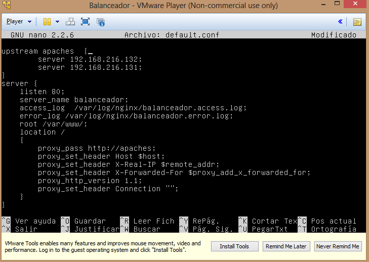
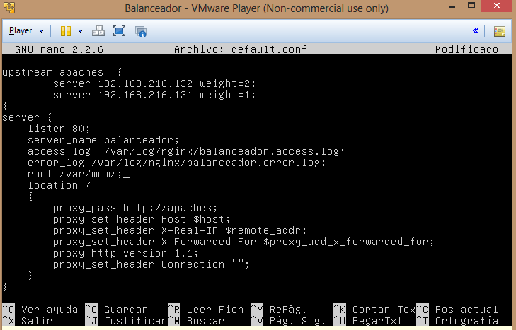
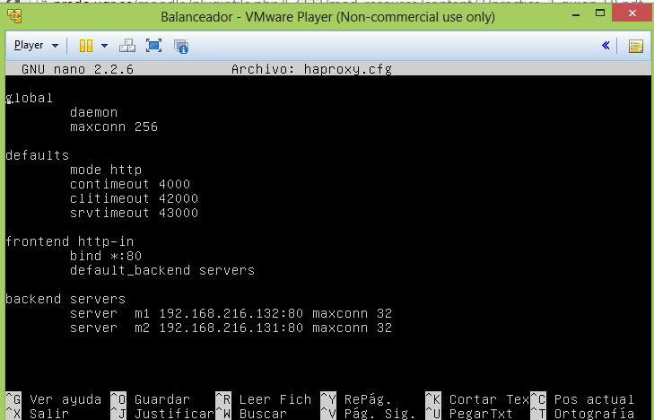
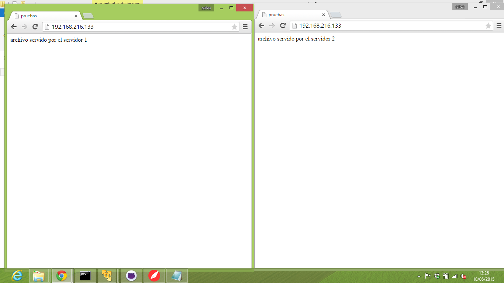

# Práctica 3. Balanceo de carga #
Tenemos que instalar una tercera máquina virtual que actuara como balanceador (no debe tener apache).

## 1. Configurar una máquina e instalarle el nginx como balanceador de carga ##

Lo primero que realizo  para instalar el nginx es cargar el paquete del repositorio. 
Una vez cargado lo instalaremos con el siguiente comando:  

apt-get install nginx

Ahora pasamos a configurar el archivo etc/nginx/conf.d/default.conf

Este tipo de configuración se la conoce como  round-robin  y consiste en que va repartiendo la carga en partes iguales conforme le va llegando peticiones de esta forma  si se envía 10 peticiones al balanceador 5 irán para el servidor 1 y otras 5 para  el servidor 2 de forma intercalada.  
Recordar que cada vez que realizamos cambios en el fichero de configuración debemos reiniciar nginx con la siguiente sentencia:  

service nginx restart

Otro algoritmo diferente seria distribuir el reparto por peso, esto es útil cuando trabajamos con servidores  de diferentes características  es decir unos más potentes que otros. La configuración quedaría así: 

En este caso de cada tres peticiones dos irán al servidor 1 mientra que la otra irá al servidor 2.
##2. Configurar una máquina e instalarle el haproxy como balanceador de carga ##

Instalamos haproxy con la siguiente sentencia:  

apt-get install haproxy 

Antes de configurar el haproxy hay que parar el  nginx ya que los dos no pueden funcionar a la vez. Para parar el nginx lo hacemos de la siguiente manera:  
service nginx stop

Ahora pasamos a configurar el archivo haproxy que se encuentra  en /etc/haproxy/haproxy.cfg de la siguiente manera:

 De esa manera estaría configurado como round-robin. Si queremos que algoritmo vaya en función del peso solo habría que añadirle el weight.

Para lanzadlo usaremos la siguiente sentencia:  

/usr/sbin/haproxy -f /etc/haproxy/haproxy.cfg.

Aquí podemos ver como el balanceador esta repartiendo la carga:

