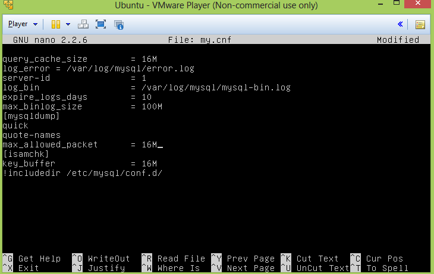
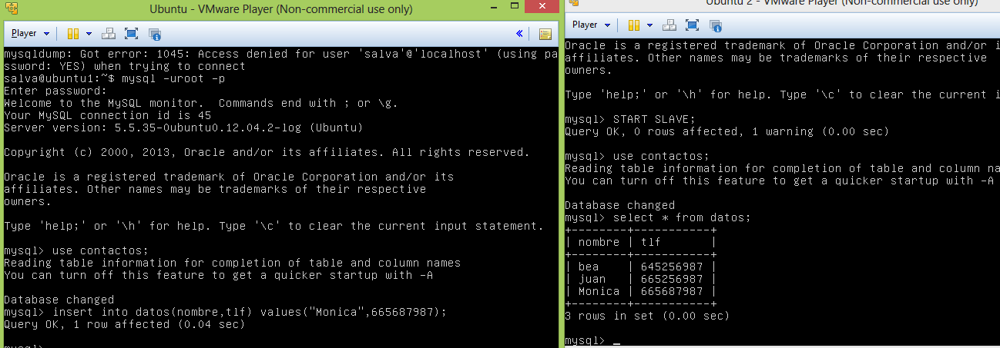

# Práctica 5. Replicación de bases de datos MySQL #
## 1. Copiar archivos de copia de seguridad mediante ssh. ##

Para copiar archivos mediante ssh es muy sencillo ya que los estudiamos en la práctica 2. Simplemente con la siguiente sentencia conseguiremos copiar el directorio que se desee en el equipo remoto. 

tar cfz - copia_seguridad | ssh 192.168.216.131 'cat > #/tar.tgz'

## 2.Clonar manualmente BD entre máquinas ##

Para clonar manualmente BD obviamente primero debemos crear una, para ello seguiremos los siguientes pasos:
1º Para acceder a mysql lo haremos con la siguiente orden: 

mysql -uroot -p
 
2º Creamos la base de datos  con:

 create database contactos;
 
 3º Nos movemos  al base de datos que hemos creado para poder insertar tablas: 
 
 use contactos;
 
 4º Creamos las tablas de la base de datos:
 
 create table datos(nombre varchar(100),tlf int);
 
 5º Insertamos valores en la tabla:
 
 insert into datos(nombre,tlf) values ("pepe",95834987);
 
 Ya tenemos nuestra BD creada por lo que ahora pasamos a clonarla manualmente gracias al comando mysqldump.
 Antes de realizar la copia debemos bloquear la base de datos para que no se este actualizándose mientras hacemos la copia de seguridad. Accedemos  a mysql y cerramos las tablas:
 
 UNLOCK TABLES;
 
 Ya podemos crear la copia con el siguiente comando: 
 
scp root@maquina1:/root/ejemplodb.sql /root/
 
 Ya podemos desbloquear las tablas con: 
   
   UNLOCK TABLES;
   
 Ahora traeremos la copia al servidor 2 con el comando scp:
   
 scp root@maquina1:/root/ejemplodb.sql /root/
 
 Ya simplemente nos queda crear una BD con el mismo nombre que la copia de seguridad e importarla a la BD .
 
##3. Configurar la estructura maestro-esclavo ##
 
Lo primero que debemos realizar es modificar el archivo /etc/mysql/my.conf configurándolo de la siguiente manera:

Para el servidor 2 lo único que variaremos es el server-id que sera igual a dos.
Al tener una versión de mysql superior a la 5.5 no puedo reiniciar el servicio con:  

service mysql restart

Vamos al servidor 2 y creamos el esclavo con los siguientes comandos dentro de mysql: 

CREATE USER esclavo IDENTIFIED BY 'esclavo'; 

GRANT REPLICATION SLAVE ON *.* TO 'esclavo'@'%'
IDENTIFIED BY 'esclavo'; 

 FLUSH PRIVILEGES; 
 
FLUSH TABLES; 

FLUSH TABLES WITH READ LOCK; 

Ahora accedemos al maestro, entramos en mysql y ponemos SHOW MASTER  STATUS para poder ver el fichero y el puerto que vamos a utilizar.
Le damos los datos del maestro: 

CHANGE MASTER TO MASTER_HOST='192.168.31.200',
MASTER_USER='esclavo', MASTER_PASSWORD='esclavo',
MASTER_LOG_FILE='mysql-bin.000007', MASTER_LOG_POS=501,
MASTER_PORT=3306; 

Y ya arrancamos el esclavo con:  

START SLAVE;

Y ya tenemos nuestra estructura maestro esclavo funcionando.

Todo lo que copiemos en la BD del maestro se actualizara en la del esclavo automáticamente.
 