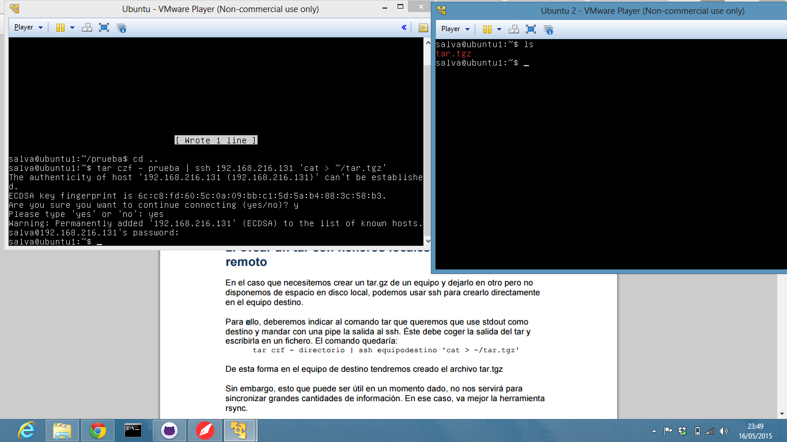
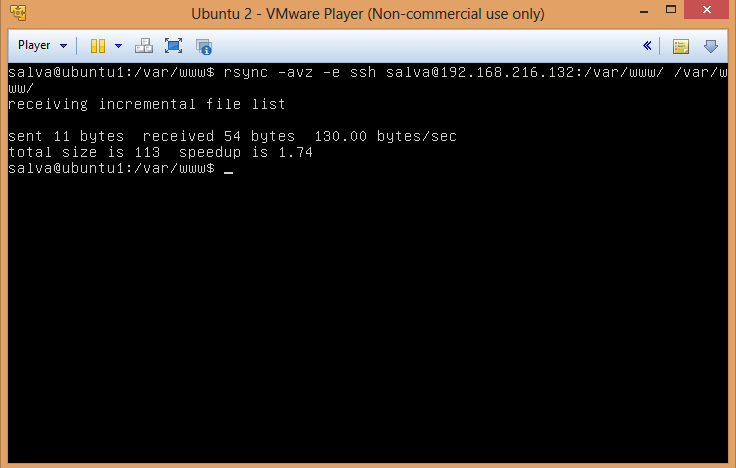
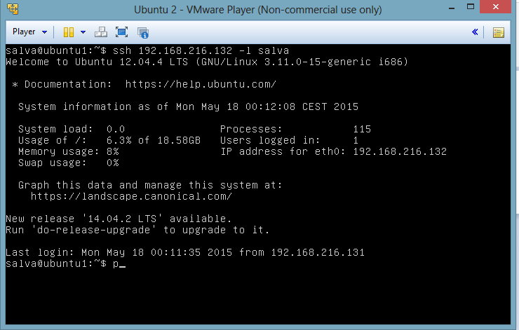

# Práctica 2. Clonar la información de un sitio web #
## 1. Probar el funcionamiento de la copia de archivos por ssh. ##
Ssh (Secure SHell) nos sirve para acceder a maquinas remota de forma segura. Ya instalamos ssh cuando instalamos ubuntu de forma manual.  
La forma de copiar archivos en otro equipo sería  comprimiendo el directorio y mandándolos a través de ssh de la  siguiente manera : 

tar czf - directorio | ssh ipequipodestino 'cat > ~/tar.tgz'   

 
## 2. Clonar contenido entre máquinas.  ##

Para clonar carpetas necesitamos instalarnos el paquete  rsync . Una vez instalado podemos pasar a la clonación de archivos de la siguiente manera: 

rsync -avz -e ssh root@maquina1:/var/www/ /var/www/ 

 
## 3. Configuración de ssh para acceder sin que solicite contraseña.  ##

Para poder acceder a través de ssh a  una maquina remota, debemos generar una clave con el siguiente comando: 

ssh-keygen -t dsa 

Dejamos el campo passphrase en blanco para que no nos solicite contraseña.
Copiamos la clave pública  en el equipo remoto .

Ya podemos acceder sin que nos pida contraseña.

 
## 4. Establecer tareas en cron  ##

Modificando el fichero /etc/crontab con la  línea que pongo a continuación logro que se actualice cada hora  en caso de cambios el contenido de la carpeta var/www/.

@hourly salva rsync -avz -e ssh salva@192.168.216.132:/var/www/ /var/www/