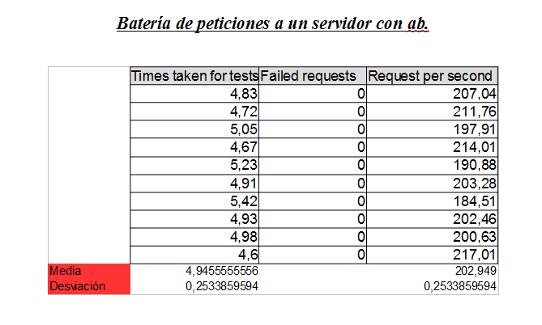
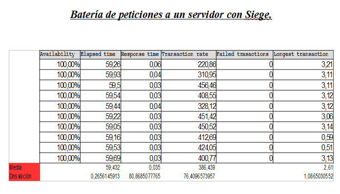
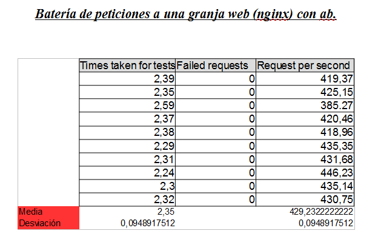
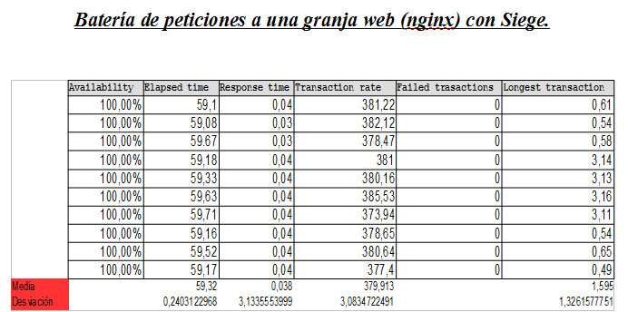
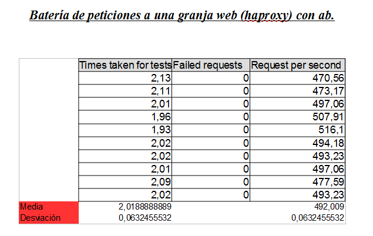
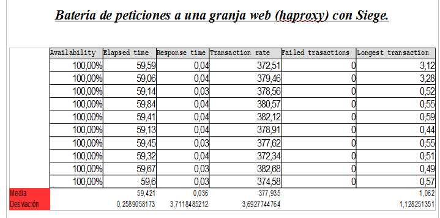
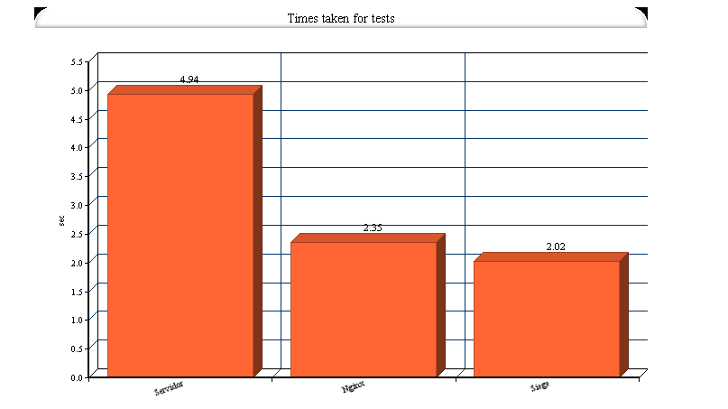
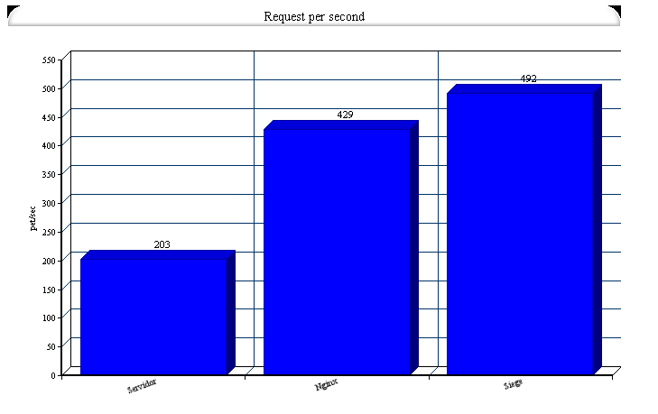
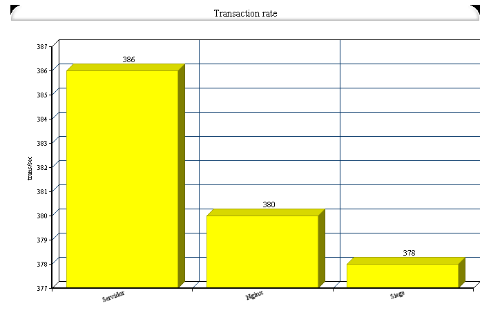
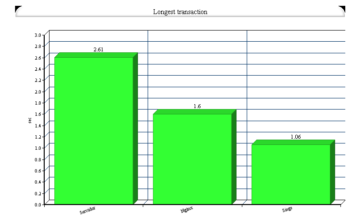

# Práctica 4. Comprobar el rendimiento de servidores web #

He lanzado varias baterías de pruebas con distintas configuraciones para observar como de importante puede ser la configuración de una granja web.
 He utilizado Siege y ab como herramientas para comprobar el rendimiento de los servidores web.   
 Para ab he utilizado la siguiente sentencia:  
 
 ab -n 1000 -c 10 http://192.168.216.133/
 
 Esto significa que estoy mando 1000 peticiones al balanceador de la granja web de 10 en 10 de forma concurrente. 
 Los datos que vamos a extraer del ab es el número de fallos, el tiempo que ha tardo en realizar el test en segundos y el número de peticiones que realiza por segundo.
 
 Para Siege he utilizado la siguiente orden:
 
 ./siege -b -t60S -v http://192.168.216.133/
 
 Por defecto  manda 15 usuarios haciendo peticiones sin descanso durante 60 segundos. Los datos que vamos a  extraer de Siege son la disponibilidad del servidor en porcentaje, el tiempo de ejecución en segundos, el tiempo medio de respuesta en segundos, el número de peticiones que se ha hecho de media por segundo y la petición que ha necesitado mas tiempo en segundos.
 
 Veamos los resultados obtenidos.  
 
 
  
  
  
  
  
  
  
  
