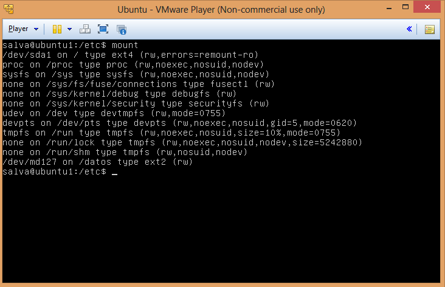
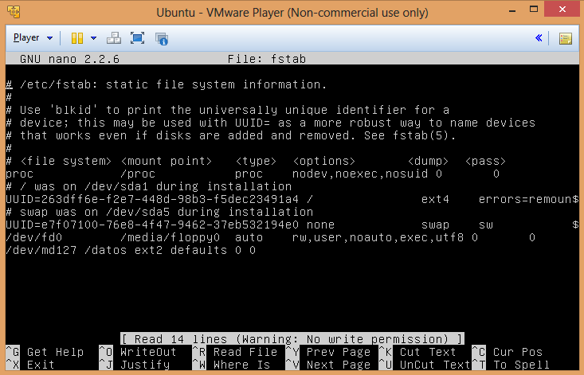
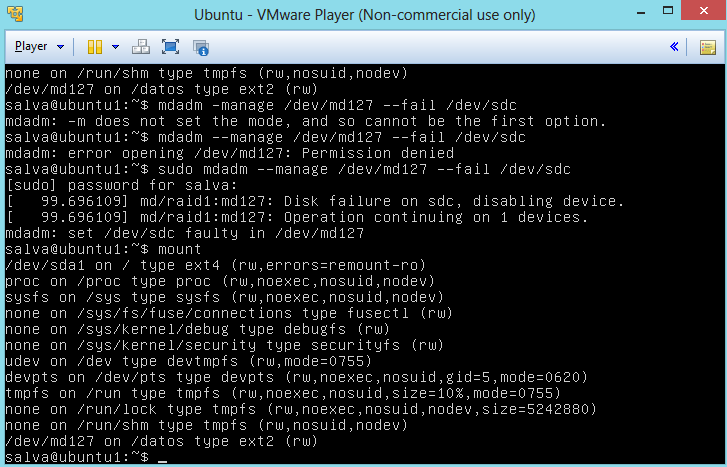
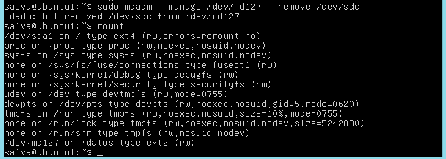

# Práctica 6.   Discos en RAID. #
## 1. Configurar dos discos en RAID 1 ##
Lo primero que hacemos es añadir dos nuevos discos duros  del mismo tamaño a nuestra máquina virtual.
Instalamos la herramienta mdadm que nos permitirá crear el RAID. 

sudo apt-get install mdadm 

Para ver  donde se encuentra los discos duros que acabamos de añadir utilizamos:  

sudo fdisk -l 

Ya podemos crear el RAID mirando el directorio donde se encuentra cada  disco: 

sudo mdadm -C /dev/md0 --level=raid1 --raid-devices=2 /dev/sdb /dev/sdc 

Ahora le damos formato con mkfs:  

sudo mkfs /dev/md0 

Creamos el directorio donde queremos que se aloje el RAID y lo montamos: 

sudo mount /dev/md0 /directorio_donde_queremos_montar_raid
 
 En la siguiente imagen podemos ver como el RAID ya esta montado. 
 

Para que se monte el servicio automáticamente debemos modificar el fichero /etc/fstab añadiendo la última línea que vemos al final.

## 2. Hacer pruebas de retirar y añadir un disco y comprobar que el RAID sigue funcionando correctamente ## 

Provocamos el fallo del RAID para comprobar que sigue funcionando: 

Como vemos en la imagen hemos provocado el fallo y podemos seguir viendo que  dev/md127 sigue montado.

Eliminamos el disco fallado y vemos que el RAID sigue montado.

Recuperamos el disco extraído simulando que lo añadimos en caliente de la siguiente manera:   

mdadm --manage /dev/md127 --add /dev/sdc 

Ya tenemos a nuestro RAID funcionando con normalidad.